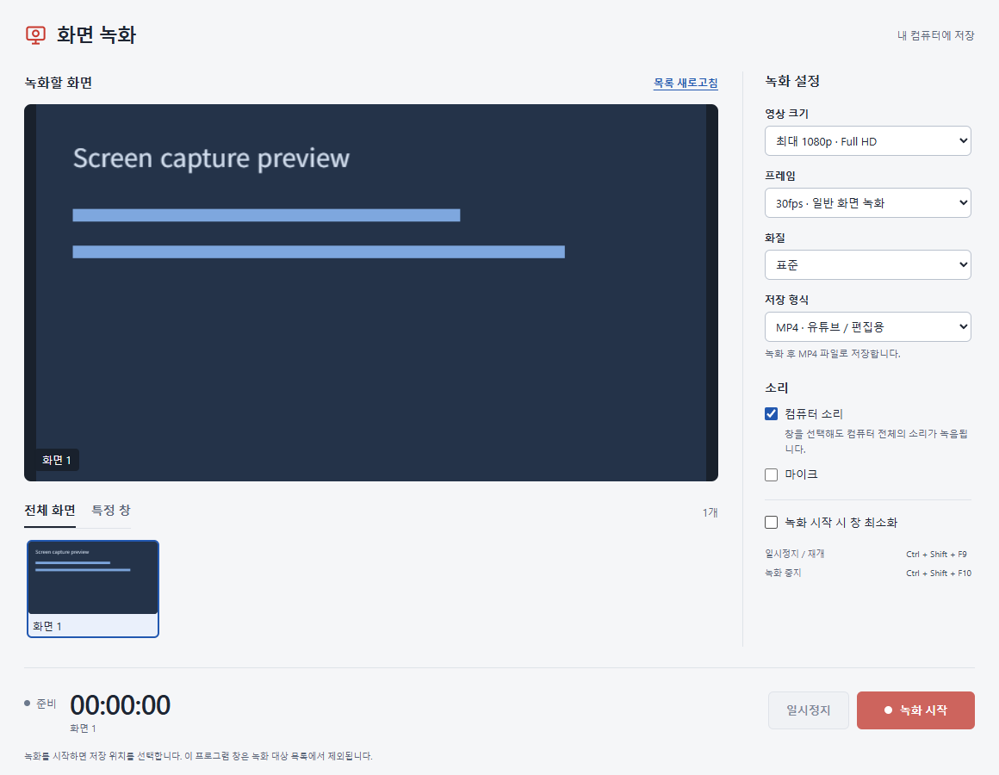

# 화면 녹화 — Windows / macOS

YouTube에 올릴 화면 설명, 강의, 프로그램 사용법 영상을 녹화하기 위한 Windows 10/11 64비트(x64)와 macOS 13 이상에서 실행하는 앱입니다. Electron으로 만들었으며 녹화 영상은 사용자가 선택한 컴퓨터의 경로에 저장합니다.



위 이미지는 합성된 녹화 대상 화면을 사용한 **테스트용 화면 예시**입니다. 사용자 실제 화면이나 녹화 영상을 포함하지 않습니다.

## 기능

- 전체 화면 또는 특정 창 선택
- 기본 최대 1080p / 30fps / 표준 화질, 해상도·프레임·화질 선택
- 컴퓨터 소리 녹음과 선택적으로 켜는 마이크 녹음, 마이크 음량 조절
- 실행 환경이 지원할 때 MP4(H.264/AAC) 저장, WebM 대체 형식
- 일시정지·재개, 녹화 시간 표시, 녹화 시작 시 창 최소화
- 전역 단축키와 작업 표시줄 알림 영역의 녹화 중지
- 기존 파일 덮어쓰기 방지, 저장 도중 오류 발생 시 임시 파일 보존

특정 창을 선택해도 **컴퓨터 전체의 소리**가 녹음됩니다. 마이크는 기본적으로 꺼져 있으며 사용자가 직접 켭니다. MP4 지원 여부는 시작할 때 실행 환경의 MediaRecorder에서 확인합니다.

## 실행

### 배포 파일

[Windows 실행용 ZIP 다운로드](https://github.com/LWH4Data/windows-screen-recorder/releases/latest/download/ScreenRecorder-Windows.zip)

Windows는 ZIP의 폴더 전체를 압축 해제한 뒤 `ScreenRecorder.exe`를 실행합니다. 실행 파일만 따로 옮기지 마세요.

macOS는 `ScreenRecorder-macOS-arm64`(Apple Silicon) 또는 `ScreenRecorder-macOS-x64`(Intel) 폴더의 `Screen Recorder.app`을 응용 프로그램 폴더에 복사해 실행합니다. `.app` 내부 파일은 따로 옮기지 마세요. 두 플랫폼의 배포 파일 모두 런타임이 포함되어 별도 Node.js 설치가 필요 없습니다. Mac 배포는 로컬 ad hoc 서명이며 Apple Developer ID 서명·공증은 포함하지 않습니다. 다운로드한 앱이 차단되면 출처를 확인한 뒤 시스템 설정 → 개인정보 보호 및 보안에서 해당 앱의 열기 안내를 따르세요.

### Mac 권한

- 처음 실행하면 화면 녹화 권한을 요청합니다. 시스템 설정 → 개인정보 보호 및 보안 → **화면 및 시스템 오디오 녹음**(버전에 따라 **화면 기록**)에서 **Screen Recorder**를 허용합니다. 앱의 권한 설정 열기 버튼으로 이동할 수 있습니다. 허용 후 시스템이 요청하면 앱을 종료하고 다시 실행하세요.
- 마이크를 켜고 처음 녹화를 시작하면 마이크 권한을 요청합니다. 거부한 경우 **마이크** 설정에서 허용하거나 앱의 마이크 옵션을 끕니다.
- 컴퓨터 소리 녹음은 **macOS 14.2 이상**에서 지원합니다. macOS 13~14.1에서는 해당 옵션이 비활성화되며 화면과 마이크 녹화는 가능합니다. 오디오 권한을 요청하면 허용하고, 짧게 녹음해 확인하세요.
- Mac 시스템 오디오 검증에는 직접 실행한 배포 `.app`을 사용하세요. `npm start`로 실행하면 권한에 **Electron** 또는 터미널·IDE가 표시될 수 있고, 부모 앱의 오디오 권한 선언에 따라 시스템 소리가 무음으로 녹음될 수 있습니다.
- 단축키는 **Cmd + Shift + F9**(일시정지/재개), **Cmd + Shift + F10**(중지)입니다. 기능 키가 미디어를 조절하면 **Fn** 키도 함께 누릅니다. 최소화된 앱은 메뉴 막대 아이콘 또는 Dock에서 다시 엽니다.

### 소스

Windows x64 또는 macOS 13 이상과 Node.js 22.12 이상/npm이 필요합니다. 저장소를 내려받고 프로젝트 폴더에서 실행합니다.

```powershell
npm ci
npm start
```

npm 설정이 설치 스크립트를 차단하여 Electron 실행 파일이 설치되지 않았다면 다음 명령을 실행한 뒤 다시 시작합니다.

```powershell
node node_modules/electron/install.js
npm start
```

## 녹화 방법

1. 전체 화면 또는 특정 창 탭에서 녹화 대상을 선택합니다.
2. 영상 크기·프레임·화질·형식과 컴퓨터 소리·마이크 설정을 확인합니다.
3. 녹화 시작을 누르고 저장할 파일 위치와 이름을 선택합니다.
4. 작업을 진행하고 일시정지 또는 녹화 중지를 누릅니다.
5. 저장 완료 안내가 나타나면 파일을 확인합니다.

| 단축키 | 기능 |
| --- | --- |
| Windows `Ctrl + Shift + F9` / Mac `Cmd + Shift + F9` | 일시정지 / 재개 |
| Windows `Ctrl + Shift + F10` / Mac `Cmd + Shift + F10` | 녹화 중지 |

다른 앱에서 해당 단축키를 사용하고 있으면 등록되지 않을 수 있습니다. 창의 버튼이나 Windows 알림 영역 / Mac 메뉴 막대 메뉴를 사용할 수 있습니다.

## 테스트

```powershell
npm test
```

녹화 파일 저장 로직의 데이터 순서, 부분 쓰기, 완료 처리, 기존 파일 보호, 디스크 오류와 임시 파일 보존을 검사합니다. 실제 화면·오디오 장치의 동작은 이 단위 테스트에서 검사하지 않습니다.

`scripts/`에는 추가 개발용 통합·캡처·배포 실행 검사가 있습니다. 실제 화면 캡처 검사는 로컬 화면에 접근하므로 해당 코드의 동작을 확인한 뒤 개발 환경에서 사용하세요.

## Windows / Mac 배포 폴더 만들기

배포할 운영체제에서 해당 아키텍처의 Node.js와 Electron 런타임으로 의존성을 설치한 뒤 실행합니다.

```powershell
npm run package
```

`dist/ScreenRecorder-Windows/`에는 `ScreenRecorder.exe`, Mac에서는 `dist/ScreenRecorder-macOS-arm64/` 또는 `dist/ScreenRecorder-macOS-x64/`에 `Screen Recorder.app`이 생성됩니다. 호스트와 설치된 런타임의 운영체제·아키텍처가 다르면 빌드를 거부합니다. Mac 빌드는 시스템의 `plutil`과 `codesign`으로 앱·보조 프로세스의 이름, 권한 설명과 로컬 서명을 설정하고 서명을 검증합니다. 이 폴더 전체를 ZIP으로 묶어서 전달합니다. 이미 같은 배포 폴더가 있으면 덮어쓰지 않으므로 기존 폴더를 별도 보관하거나 `SCREEN_RECORDER_OUTPUT_DIR` 환경 변수로 다른 출력 폴더를 지정하세요. 런타임에 포함된 라이선스 안내도 함께 배포됩니다.

`package.json`의 `private: true`는 npm에 의도치 않게 게시하는 것을 방지합니다.

## 제한과 사용 전 확인

- 일반 화면 녹화용 기본 버전입니다. 게임 전용 캡처, 자유 영역 선택, 웹캠, 영상 편집, YouTube 자동 업로드는 포함하지 않습니다.
- 실제 해상도, 프레임, 인코딩 비트레이트, MP4 지원과 음성 싱크는 PC와 장치에 따라 달라집니다. 긴 녹화 전에 **실제 PC에서 짧게 시험 녹화하고 저장한 영상과 소리를 재생해 확인**하세요.
- 마이크 사용 시 Windows 개인정보 설정 또는 Mac 시스템 설정에서 마이크 접근 허용이 필요할 수 있습니다. 컴퓨터 소리와 마이크를 함께 쓰면 헤드폰으로 울림을 줄일 수 있습니다.
- 전체 화면 녹화에는 이 앱의 창, 알림, 저장 대화상자가 나타날 수 있습니다. 앱 자체는 녹화 대상 목록에서 제외됩니다.
- 복사 방지 영상, 관리자 권한 창, 잠긴 화면 등은 검은 화면으로 보이거나 캡처가 중단될 수 있습니다.
- 기록 중에는 `<파일명>.recording` 임시 파일을 사용합니다. 강제 종료나 저장 오류 후 복구를 보장하지 않습니다. 충분한 디스크 공간을 확보하세요.
- Windows 앱은 전자 서명되지 않았으며 실행 확인이 나타날 수 있습니다. Mac 앱은 로컬 ad hoc 서명이며 Developer ID 서명·공증되지 않았습니다.

### 개발용 검증

```sh
node scripts/integration.cjs
node scripts/package-smoke.cjs "dist/ScreenRecorder-macOS-arm64/Screen Recorder.app"
node scripts/capture-smoke.cjs "dist/ScreenRecorder-macOS-arm64/Screen Recorder.app"
```

통합 검사는 합성 화면·오디오로 실제 MediaRecorder, 저장과 재생, 권한 거부 복구를 검사합니다. 배포 시작 검사는 `.app` 또는 Windows `.exe` 경로를 받습니다. 캡처 검사는 별도의 합성 창을 실제 캡처하고 1.5초 후 화면·오디오 트랙이 살아 있는지 검사하고, Mac에서는 작은 합성음을 재생해 실제 시스템 오디오 샘플 입력도 확인합니다. 사용자 화면 영상은 저장하지 않지만 화면 목록의 썸네일을 메모리에서 열람하며 macOS 권한 허용이 필요합니다. 시스템 오디오 장치마다 실제 소리가 정상인지 별도 시험 녹화가 필요합니다.

자세한 사용법은 [사용법.txt](사용법.txt)를 참고하세요.
